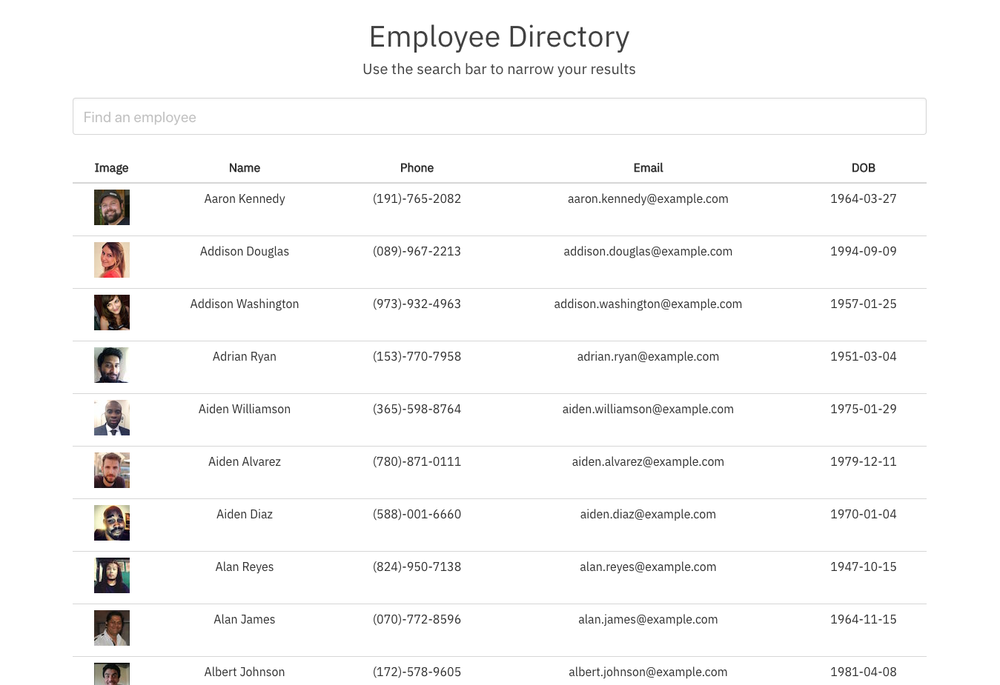

# React Employee Directory

## Table of Contents

- [Description](#description)
- [Screenshot](#screenshot)
- [Contributions](#contributions)
- [License](#license)

## Description

React.js app that dynamically filters and sorts a list of 500 employees generated via randomuser.me api.

## Screenshot

## Contributions

Thanks to Kris Renaldi and Peter Colella for their valuable input.

## License

MIT License

Copyright (c) 2020 Andrew Stewart
